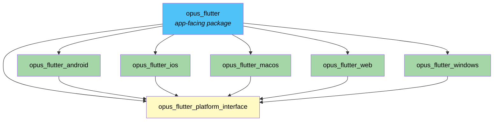
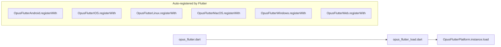
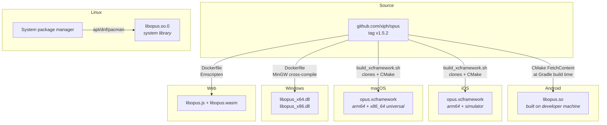
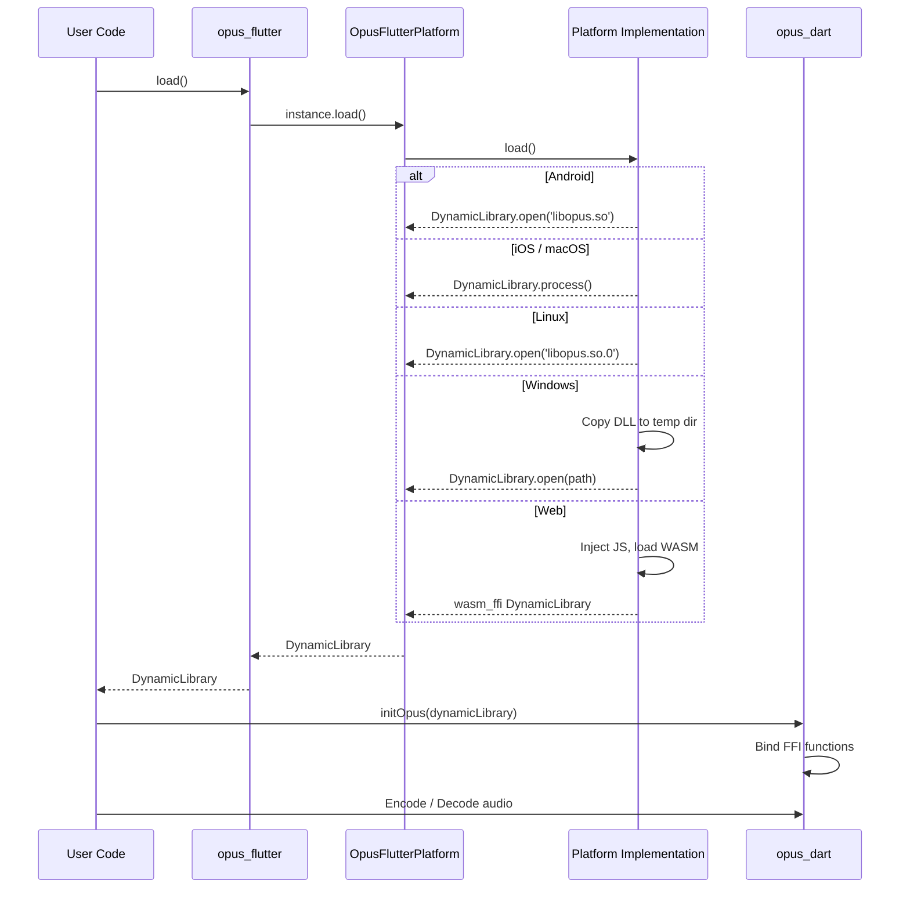

# Architecture

This document explains how the opus_flutter library works, from high-level design decisions down to platform-specific implementation details.

## Overview

opus_flutter is a **federated Flutter plugin** whose sole purpose is to load the [Opus audio codec](https://opus-codec.org/) as a `DynamicLibrary` so it can be consumed by [opus_dart](https://pub.dev/packages/opus_dart). It does not expose Opus encoding/decoding APIs directly -- that responsibility belongs to opus_dart.

The plugin follows Flutter's [federated plugin architecture](https://docs.flutter.dev/packages-and-plugins/developing-packages#federated-plugins), which splits a plugin into:

1. An **app-facing package** that developers add to their `pubspec.yaml`.
2. A **platform interface** that defines the contract all implementations must satisfy.
3. One or more **platform packages**, each containing the native code and Dart glue for a single platform.

## Package Dependency Graph



All platform packages depend on `opus_flutter_platform_interface`. The main `opus_flutter` package depends on all of them and declares the federated plugin mapping in its `pubspec.yaml`.

## Platform Interface

The core abstraction lives in `opus_flutter_platform_interface`:

```dart
abstract class OpusFlutterPlatform extends PlatformInterface {
  static OpusFlutterPlatform _instance = OpusFlutterPlatformUnsupported();

  static OpusFlutterPlatform get instance => _instance;
  static set instance(OpusFlutterPlatform instance) { ... }

  Future<Object> load() {
    throw UnimplementedError('load() has not been implemented.');
  }
}
```

Key design points:

- Extends `PlatformInterface` from `plugin_platform_interface` to enforce that implementations extend (not implement) the class.
- Holds a static singleton `instance` that each platform package replaces at registration time.
- The default instance is `OpusFlutterPlatformUnsupported`, which throws `UnsupportedError`.
- The single API surface is `Future<Object> load()`, which returns a `DynamicLibrary`.

The return type is `Object` rather than a specific `DynamicLibrary` because the web uses `wasm_ffi`'s `DynamicLibrary` class (a separate type from `dart:ffi`'s `DynamicLibrary`).

## Plugin Registration

Each platform package declares a `dartPluginClass` in its `pubspec.yaml`. Flutter automatically calls the static `registerWith()` method during app initialization, which sets `OpusFlutterPlatform.instance` to the platform-specific implementation.



The main package has a single entry point (`opus_flutter_load.dart`) that delegates to `OpusFlutterPlatform.instance.load()`. No platform-specific imports or conditional exports are needed.

## Platform Implementations

### Android

| Aspect | Detail |
|--------|--------|
| Language | Java (plugin stub), C (opus via CMake) |
| Library loading | `DynamicLibrary.open('libopus.so')` |
| Opus distribution | Built from source at Gradle build time via CMake `FetchContent` (fetches opus v1.5.2 from GitHub) |
| Plugin class | `OpusFlutterAndroidPlugin` -- empty `FlutterPlugin` stub |

The Android build uses `FetchContent` in `CMakeLists.txt` to download opus source and compile it as a shared library. This means no opus source code is checked into the repository for Android.

### iOS

| Aspect | Detail |
|--------|--------|
| Language | Swift + Objective-C (plugin stub) |
| Library loading | `DynamicLibrary.process()` (opus is statically linked via the vendored framework) |
| Opus distribution | Pre-built `opus.xcframework` with slices for `ios-arm64` (device) and `ios-arm64_x86_64-simulator` |
| Build script | `build_xcframework.sh` clones opus, builds with CMake, wraps as dynamic framework, assembles xcframework |
| Plugin class | `OpusFlutterIosPlugin` (ObjC) bridges to `SwiftOpusFlutterIosPlugin` (Swift) -- both are empty stubs |

Since opus is linked into the process, `DynamicLibrary.process()` finds the symbols without needing a file path.

### macOS

| Aspect | Detail |
|--------|--------|
| Language | Swift (plugin stub) |
| Library loading | `DynamicLibrary.process()` |
| Opus distribution | Pre-built `opus.xcframework` with a `macos-arm64_x86_64` universal binary |
| Build script | `build_xcframework.sh` -- same approach as iOS, targeting the `macosx` SDK |
| Plugin class | `OpusFlutterMacosPlugin` -- empty stub importing `FlutterMacOS` |

### Linux

| Aspect | Detail |
|--------|--------|
| Language | Dart only (no native plugin class) |
| Library loading | `DynamicLibrary.open('libopus.so.0')` |
| Opus distribution | System library -- not bundled with the plugin |
| Registration | Uses `dartPluginClass: OpusFlutterLinux` with `pluginClass: none` |

Unlike other platforms, the Linux implementation does not bundle opus. It loads the system-installed `libopus.so.0` at runtime. Users must install `libopus` via their distribution's package manager.

### Windows

| Aspect | Detail |
|--------|--------|
| Language | Dart only (no native plugin class) |
| Library loading | `DynamicLibrary.open(path)` after copying DLL to a temp directory |
| Opus distribution | Pre-built DLLs (`libopus_x64.dll.blob`, `libopus_x86.dll.blob`) stored as Flutter assets |
| Build method | Cross-compiled from Linux using MinGW via Docker (`Dockerfile`) |
| Registration | Uses `dartPluginClass: OpusFlutterWindows` with `pluginClass: none` |

At runtime, the Windows implementation:

1. Uses `path_provider` to get a temp directory.
2. Copies the correct DLL (x64 or x86 based on `Platform.version`) from assets to disk.
3. Also copies the opus license file.
4. Opens the DLL with `DynamicLibrary.open()`.

### Web

| Aspect | Detail |
|--------|--------|
| Language | Dart (uses `wasm_ffi` and `inject_js`) |
| Library loading | Injects `libopus.js`, loads `libopus.wasm`, returns `wasm_ffi` `DynamicLibrary` |
| Opus distribution | Pre-built `libopus.js` + `libopus.wasm` stored as Flutter assets |
| Build method | Compiled with Emscripten via Docker (`Dockerfile`) |
| Registration | Uses `pluginClass: OpusFlutterWeb` with `fileName: opus_flutter_web.dart` |

The web implementation:

1. Injects the Emscripten-generated JS glue (`libopus.js`) into the page.
2. Fetches the WASM binary (`libopus.wasm`).
3. Initializes `wasm_ffi`'s `Memory` and compiles the Emscripten module.
4. Returns a `wasm_ffi` `DynamicLibrary.fromModule()`.

## Opus Build Pipeline

Each platform has a different strategy for building and distributing the opus binary:



## Opus Version

All platforms build from or bundle **libopus v1.5.2**, fetched from https://github.com/xiph/opus. On Linux, the system-installed version is used.

## Data Flow



## Example App

The example app (`opus_flutter/example`) demonstrates:

1. Loading opus via `opus_flutter.load()`.
2. Initializing opus_dart with the loaded library.
3. Reading a raw PCM audio file from assets.
4. Streaming it through `StreamOpusEncoder` then `StreamOpusDecoder`.
5. Wrapping the result in a WAV header.
6. Sharing the output file via `share_plus`.
