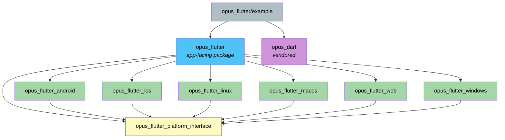
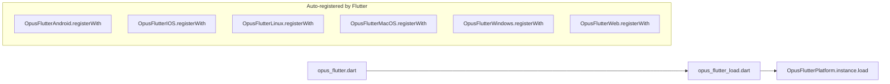
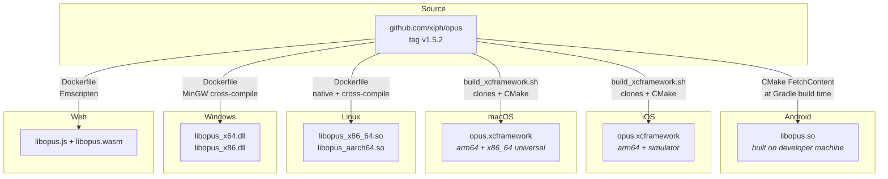
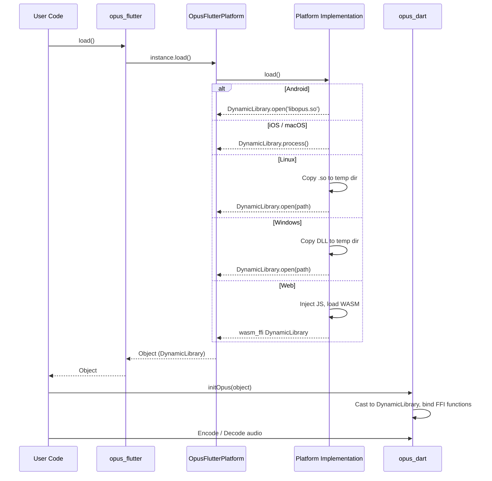

# Architecture

This document explains how the opus_flutter library works, from high-level design decisions down to platform-specific implementation details.

## Overview

opus_flutter is a **federated Flutter plugin** whose sole purpose is to load the [Opus audio codec](https://opus-codec.org/) as a `DynamicLibrary` so it can be consumed by the vendored `opus_dart` package. It does not expose Opus encoding/decoding APIs directly -- that responsibility belongs to opus_dart.

`opus_dart` was originally an [external package](https://github.com/EPNW/opus_dart) but has been vendored into this repository to reduce external dependency complexity and allow direct maintenance (Dart 3 compatibility fixes, type safety improvements, etc.).

The plugin follows Flutter's [federated plugin architecture](https://docs.flutter.dev/packages-and-plugins/developing-packages#federated-plugins), which splits a plugin into:

1. An **app-facing package** that developers add to their `pubspec.yaml`.
2. A **platform interface** that defines the contract all implementations must satisfy.
3. One or more **platform packages**, each containing the native code and Dart glue for a single platform.

## Package Dependency Graph



All platform packages depend on `opus_flutter_platform_interface`. The main `opus_flutter` package depends on all of them and declares the federated plugin mapping in its `pubspec.yaml`. The vendored `opus_dart` package consumes the `DynamicLibrary` returned by `opus_flutter.load()` and provides the actual encoding/decoding APIs.

## Vendored opus_dart

`opus_dart` lives at `opus_dart/` in the repository root. It was vendored from [EPNW/opus_dart](https://github.com/EPNW/opus_dart) (v3.0.1) and updated for Dart 3 and `wasm_ffi` 2.x compatibility.

### Cross-platform FFI via proxy_ffi.dart

`opus_dart` must work with both `dart:ffi` (native platforms) and `wasm_ffi` (web). This is handled by `proxy_ffi.dart`, which uses Dart conditional exports:

```dart
export 'dart:ffi' if (dart.library.js_interop) 'package:wasm_ffi/ffi.dart';
export 'init_ffi.dart' if (dart.library.js_interop) 'init_web.dart';
```

All source files import `proxy_ffi.dart` instead of `dart:ffi` directly, getting the correct platform types resolved at compile time. This allows a single codebase for both native and web.

### Initialization flow

`initOpus(Object opusLib)` accepts `Object` so callers don't need to cast from the platform interface's `Future<Object>` return type. The platform-specific `createApiObject()` (from `init_ffi.dart` or `init_web.dart`, selected by the conditional export) casts to the concrete `DynamicLibrary` and creates the `ApiObject` with properly typed fields.

### Type safety: why dynamic was eliminated

The original `opus_dart` used `dynamic` for several fields and parameters to bridge the gap between `dart:ffi` and `web_ffi` types. This caused **runtime crashes** in modern Dart because many `dart:ffi` methods that appear to be instance methods are actually **extension methods** -- and extension methods cannot be dispatched through `dynamic`.

Methods that fail through `dynamic` dispatch:
- `Allocator.call<T>()` -- allocates `sizeOf<T>() * count` bytes
- `Pointer<Uint8>.operator []` -- indexed byte access
- `Pointer<T>.asTypedList()` -- creates a typed view over native memory
- `Pointer<T>.value` (getter) -- reads the value at a pointer
- `DynamicLibrary.lookupFunction<>()` -- looks up and binds a native function

All fields and parameters are now statically typed (using types from `proxy_ffi.dart`), so extension methods resolve at compile time. The only `dynamic` that remains is suppressed via `// ignore_for_file` in `init_web.dart`, which is a web-only file analyzed on native where `wasm_ffi` types don't match `dart:ffi` types -- a known limitation of the conditional import pattern.

## Platform Interface

The core abstraction lives in `opus_flutter_platform_interface`:

```dart
abstract class OpusFlutterPlatform extends PlatformInterface {
  static OpusFlutterPlatform _instance = OpusFlutterPlatformUnsupported();

  static OpusFlutterPlatform get instance => _instance;
  static set instance(OpusFlutterPlatform instance) { ... }

  Future<Object> load() {
    throw UnimplementedError('load() has not been implemented.');
  }
}
```

Key design points:

- Extends `PlatformInterface` from `plugin_platform_interface` to enforce that implementations extend (not implement) the class.
- Holds a static singleton `instance` that each platform package replaces at registration time.
- The default instance is `OpusFlutterPlatformUnsupported`, which throws `UnsupportedError`.
- The single API surface is `Future<Object> load()`, which returns a `DynamicLibrary`.

The return type is `Object` rather than a specific `DynamicLibrary` because the web uses `wasm_ffi`'s `DynamicLibrary` class (a separate type from `dart:ffi`'s `DynamicLibrary`).

## Plugin Registration

Each platform package declares a `dartPluginClass` in its `pubspec.yaml`. Flutter automatically calls the static `registerWith()` method during app initialization, which sets `OpusFlutterPlatform.instance` to the platform-specific implementation.



The main package has a single entry point (`opus_flutter_load.dart`) that delegates to `OpusFlutterPlatform.instance.load()`. No platform-specific imports or conditional exports are needed.

## Platform Implementations

### Android

| Aspect | Detail |
|--------|--------|
| Language | Java (plugin stub), C (opus via CMake) |
| Library loading | `DynamicLibrary.open('libopus.so')` |
| Opus distribution | Built from source at Gradle build time via CMake `FetchContent` (fetches opus v1.5.2 from GitHub) |
| Plugin class | `OpusFlutterAndroidPlugin` -- empty `FlutterPlugin` stub |

The Android build uses `FetchContent` in `CMakeLists.txt` to download opus source and compile it as a shared library. This means no opus source code is checked into the repository for Android.

### iOS

| Aspect | Detail |
|--------|--------|
| Language | Swift + Objective-C (plugin stub) |
| Library loading | `DynamicLibrary.process()` (opus is statically linked via the vendored framework) |
| Opus distribution | Pre-built `opus.xcframework` with slices for `ios-arm64` (device) and `ios-arm64_x86_64-simulator` |
| Build script | `build_xcframework.sh` clones opus, builds with CMake, wraps as dynamic framework, assembles xcframework |
| Plugin class | `OpusFlutterIosPlugin` (ObjC) bridges to `SwiftOpusFlutterIosPlugin` (Swift) -- both are empty stubs |

Since opus is linked into the process, `DynamicLibrary.process()` finds the symbols without needing a file path.

### macOS

| Aspect | Detail |
|--------|--------|
| Language | Swift (plugin stub) |
| Library loading | `DynamicLibrary.process()` |
| Opus distribution | Pre-built `opus.xcframework` with a `macos-arm64_x86_64` universal binary |
| Build script | `build_xcframework.sh` -- same approach as iOS, targeting the `macosx` SDK |
| Plugin class | `OpusFlutterMacosPlugin` -- empty stub importing `FlutterMacOS` |

### Linux

| Aspect | Detail |
|--------|--------|
| Language | Dart only (no native plugin class) |
| Library loading | `DynamicLibrary.open(path)` after copying `.so` to a temp directory |
| Opus distribution | Pre-built shared libraries (`libopus_x86_64.so.blob`, `libopus_aarch64.so.blob`) stored as Flutter assets |
| Build method | Native + cross-compiled from Docker (`Dockerfile`, Ubuntu 20.04 base for glibc 2.31 compatibility) |
| Fallback | If bundled binary fails to load, falls back to system `libopus.so.0` |
| Registration | Uses `dartPluginClass: OpusFlutterLinux` with `pluginClass: none` |

At runtime, the Linux implementation:

1. Detects architecture via `Abi.current()` (`linuxX64` or `linuxArm64`).
2. Copies the matching `.so.blob` asset from `rootBundle` to a temp directory.
3. Opens the copied library with `DynamicLibrary.open()`.
4. If any step fails, falls back to `DynamicLibrary.open('libopus.so.0')` (system library).

### Windows

| Aspect | Detail |
|--------|--------|
| Language | Dart only (no native plugin class) |
| Library loading | `DynamicLibrary.open(path)` after copying DLL to a temp directory |
| Opus distribution | Pre-built DLLs (`libopus_x64.dll.blob`, `libopus_x86.dll.blob`) stored as Flutter assets |
| Build method | Cross-compiled from Linux using MinGW via Docker (`Dockerfile`) |
| Registration | Uses `dartPluginClass: OpusFlutterWindows` with `pluginClass: none` |

At runtime, the Windows implementation:

1. Uses `path_provider` to get a temp directory.
2. Copies the correct DLL (x64 or x86 based on `Platform.version`) from assets to disk.
3. Also copies the opus license file.
4. Opens the DLL with `DynamicLibrary.open()`.

### Web

| Aspect | Detail |
|--------|--------|
| Language | Dart (uses `wasm_ffi`) |
| Library loading | `DynamicLibrary.open()` handles JS injection, WASM loading, and memory setup |
| Opus distribution | Pre-built `libopus.js` + `libopus.wasm` stored as Flutter assets |
| Build method | Compiled with Emscripten via Docker (`Dockerfile`) |
| Registration | Uses `pluginClass: OpusFlutterWeb` with `fileName: opus_flutter_web.dart` |

The web implementation calls `wasm_ffi`'s `DynamicLibrary.open()` which internally:

1. Injects the Emscripten-generated JS glue (`libopus.js`) into the page.
2. Compiles the Emscripten module and loads the WASM binary.
3. Initializes memory (registers as global if none is set).
4. Returns a `wasm_ffi` `DynamicLibrary`.

## Opus Build Pipeline

Each platform has a different strategy for building and distributing the opus binary:



## Opus Version

All platforms build from or bundle **libopus v1.5.2**, fetched from https://github.com/xiph/opus. On Linux, the system-installed version is used.

## Data Flow



## Example App

The example app (`opus_flutter/example`) demonstrates:

1. Loading opus via `opus_flutter.load()` (returns `Future<Object>`).
2. Passing the result directly to `initOpus()` -- no cast needed.
3. Reading a raw PCM audio file from assets.
4. Streaming it through `StreamOpusEncoder` then `StreamOpusDecoder`.
5. Wrapping the result in a WAV header.
6. Sharing the output file via `share_plus`.

The example depends on the vendored `opus_dart` via a path dependency (`path: ../../opus_dart`).
