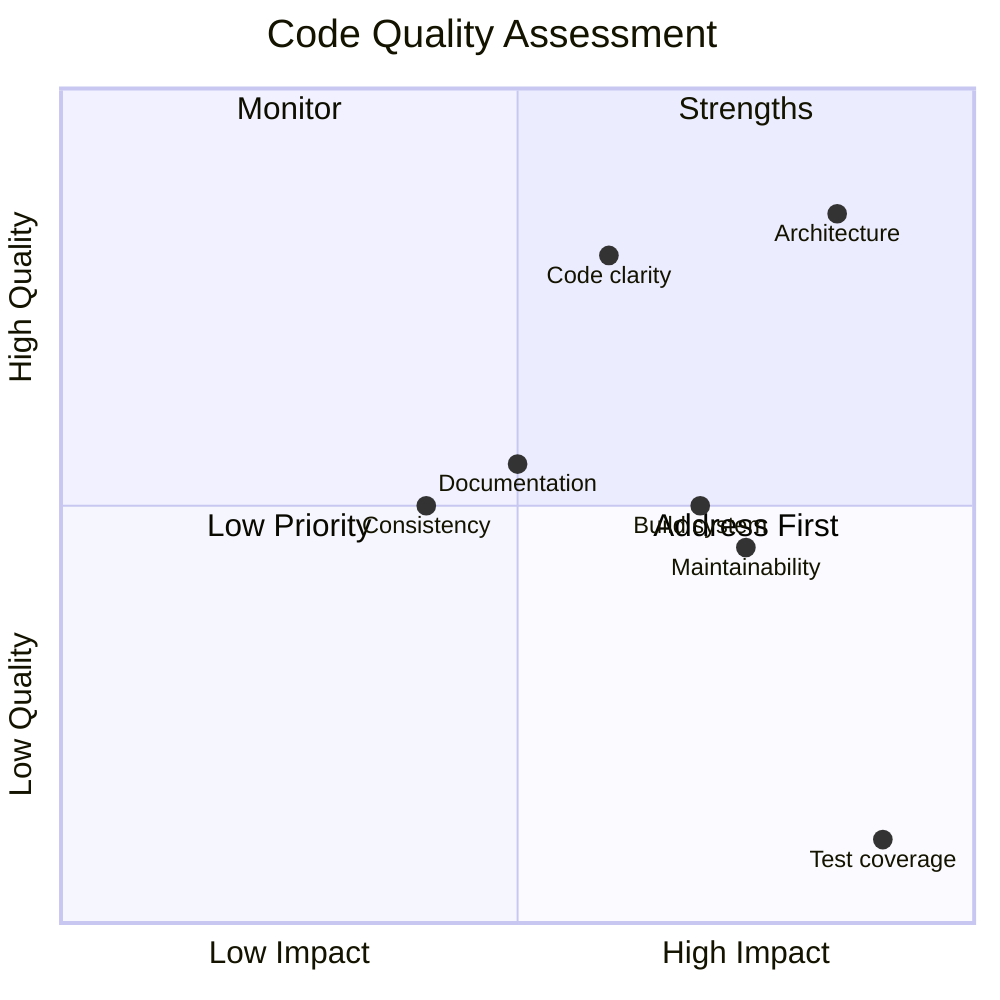

# Code Quality

This document provides an assessment of the opus_flutter codebase's quality across multiple dimensions.

## Summary

| Dimension | Rating | Notes |
|-----------|--------|-------|
| Architecture | Good | Clean federated plugin structure |
| Code clarity | Good | Small, focused files with clear intent |
| Documentation | Fair | Public APIs documented, some packages lack detail |
| Test coverage | Poor | No tests in any package |
| Consistency | Fair | Mixed patterns across packages |
| Maintainability | Fair | Stale workarounds and dependencies |
| Build system | Fair | Works but fragile in places |

---

## Architecture

**Rating: Good**

The project follows Flutter's recommended federated plugin pattern correctly:

- Clear separation between the app-facing package, platform interface, and platform implementations.
- Each package has a single responsibility.
- The platform interface uses `PlatformInterface` from `plugin_platform_interface` with proper token verification.
- Conditional exports cleanly separate web and native code paths.

**Weakness:** The FFI entry point (`opus_flutter_ffi.dart`) imports all platform packages regardless of which platform is running. This cross-imports Android code into iOS builds and vice versa. It is done as a workaround but has architectural implications.

---

## File-by-File Analysis

### Platform Interface (`opus_flutter_platform_interface`)

| File | Lines | Quality | Notes |
|------|-------|---------|-------|
| `opus_flutter_platform_interface.dart` | 3 | Good | Clean barrel export |
| `opus_flutter_platform_interface.dart` (src) | 46 | Good | Proper PlatformInterface usage, clear docs |
| `opus_flutter_platform_unsupported.dart` | 12 | Good | Appropriate default fallback |

No issues. Well-structured.

### Main Package (`opus_flutter`)

| File | Lines | Quality | Notes |
|------|-------|---------|-------|
| `opus_flutter.dart` | 8 | Good | Clean conditional export |
| `opus_flutter_ffi.dart` | 52 | Fair | Workarounds add complexity; all platforms imported |
| `opus_flutter_web.dart` | 16 | Good | Simple delegation |

`opus_flutter_ffi.dart` is the most complex file in the project. The workaround functions are documented with issue links, which is good practice. However, the file imports platform packages that are irrelevant on the running platform.

### Android (`opus_flutter_android`)

| File | Lines | Quality | Notes |
|------|-------|---------|-------|
| `opus_flutter_android.dart` | 13 | Good | Clean, minimal |
| `OpusFlutterAndroidPlugin.java` | 14 | Good | Empty stub, expected for FFI-only plugins |
| `CMakeLists.txt` | 16 | Good | Modern FetchContent approach |
| `build.gradle` | 59 | Fair | Legacy build syntax |

The CMakeLists.txt is well-written and concise. The build.gradle uses legacy syntax (`apply plugin` instead of `plugins {}` DSL) and includes test dependencies (`junit`, `mockito`) but has no actual tests.

### iOS (`opus_flutter_ios`)

| File | Lines | Quality | Notes |
|------|-------|---------|-------|
| `opus_flutter_ios.dart` | 13 | Good | Clean, minimal |
| `SwiftOpusFlutterIosPlugin.swift` | 10 | Fair | Empty stub |
| `OpusFlutterIosPlugin.m` | 16 | Fair | ObjC bridge to Swift, unnecessary complexity |
| `OpusFlutterIosPlugin.h` | 5 | Fair | Part of unnecessary ObjC bridge |
| `build_xcframework.sh` | 239 | Good | Well-structured, documented, error handling |

The ObjC-to-Swift bridge pattern is inherited from older Flutter plugin templates. Modern plugins can use Swift-only registration. The build script is well-written with clear sections, error checking, and cleanup.

### macOS (`opus_flutter_macos`)

| File | Lines | Quality | Notes |
|------|-------|---------|-------|
| `opus_flutter_macos.dart` | 14 | Good | Clean, uses `@override` |
| `OpusFlutterMacosPlugin.swift` | 8 | Good | Minimal Swift-only stub |
| `build_xcframework.sh` | 222 | Good | Adapted from iOS script, well-structured |

Cleanest platform implementation. Uses Swift-only registration (no ObjC bridge).

### Web (`opus_flutter_web`)

| File | Lines | Quality | Notes |
|------|-------|---------|-------|
| `opus_flutter_web.dart` | 42 | Good | Most complex platform impl, uses actively maintained wasm_ffi |

The web implementation is the most involved platform package. It has to inject JavaScript, load WASM, initialize memory, and bridge through `wasm_ffi`. The migration from the unmaintained `web_ffi` to `wasm_ffi` (v2.2.0, actively maintained) has resolved the dependency risk.

### Windows (`opus_flutter_windows`)

| File | Lines | Quality | Notes |
|------|-------|---------|-------|
| `opus_flutter_windows.dart` | 58 | Fair | Asset copying logic, fragile arch detection |

The Windows implementation has the most runtime logic: copying DLLs from assets to a temp directory, detecting architecture via string parsing, and loading dynamically. The `Platform.version.contains('x64')` check is fragile.

### Example App

| File | Lines | Quality | Notes |
|------|-------|---------|-------|
| `main.dart` | 179 | Fair | Functional demo, some style issues |

Style issues:
- `void _share(Uint8List data) async` should be `Future<void> _share(...)`.
- Empty `initState()` override should be removed.
- Uses `new` keyword inconsistently (e.g., `new OpusFlutterAndroid()` in ffi.dart).

---

## Dart Style and Conventions

### Positive Patterns

- Doc comments on all public APIs using `///` syntax.
- `@override` annotations used (macOS package).
- Conditional exports used correctly.
- Issue references in workaround comments.
- Clear package naming following Flutter conventions.

### Issues Found

| Issue | Location | Severity |
|-------|----------|----------|
| `new` keyword used in Dart 3 codebase | `opus_flutter_ffi.dart` | Low |
| `void` return with `async` | `example/main.dart` | Low |
| Empty `initState()` override | `example/main.dart` | Low |
| Missing `@override` on `load()` | `opus_flutter_ios.dart`, `opus_flutter_android.dart` | Low |
| Inconsistent quote style (double vs single) | Various `pubspec.yaml` files | Low |

---

## Dependency Health

```mermaid
graph LR
    subgraph Low Risk
        A[plugin_platform_interface<br>^2.1.8 &#x2022; Active]
        B[flutter_lints<br>^5.0.0 &#x2022; Active]
        C[path_provider<br>^2.1.5 &#x2022; Active]
        D[share_plus<br>^10.0.0 &#x2022; Active]
        E[platform_info<br>^5.0.0 &#x2022; Active]
    end

    subgraph Medium Risk
        F[inject_js<br>^2.1.0 &#x2022; 15 months ago]
        G[opus_dart<br>^3.0.1 &#x2022; 2 years ago]
    end

    subgraph Low Risk
        H[wasm_ffi<br>^2.2.0 &#x2022; active]
    end

    style A fill:#c8e6c9,color:#000
    style B fill:#c8e6c9,color:#000
    style C fill:#c8e6c9,color:#000
    style D fill:#c8e6c9,color:#000
    style E fill:#c8e6c9,color:#000
    style F fill:#fff9c4,color:#000
    style G fill:#fff9c4,color:#000
    style H fill:#ffcdd2,color:#000
```

| Dependency | Version | Last Updated | Risk |
|------------|---------|-------------|------|
| `plugin_platform_interface` | ^2.1.8 | Active | Low |
| `flutter_lints` | ^5.0.0 | Active | Low |
| `path_provider` | ^2.1.5 | Active | Low |
| `inject_js` | ^2.1.0 | 15 months ago | Medium |
| `wasm_ffi` | ^2.2.0 | Active | Low |
| `opus_dart` | ^3.0.1 | 2 years ago | Medium |
| `share_plus` | ^10.0.0 | Active | Low |
| `platform_info` | ^5.0.0 | Active | Low |

The migration from `web_ffi` to `wasm_ffi` has eliminated the previously highest-risk dependency.

---

## Build System Quality

### Android
- **Approach:** CMake FetchContent (downloads opus at build time).
- **Strength:** No vendored sources; always builds from a pinned tag.
- **Risk:** Requires internet during build; network issues or removed GitHub tags will break builds.
- **AGP:** Uses legacy 7.3.0 with `apply plugin` syntax.

### iOS
- **Approach:** Pre-built xcframework via shell script.
- **Strength:** Deterministic; no network needed at app build time.
- **Risk:** Script must be re-run manually to update opus.

### macOS
- **Approach:** Same as iOS.
- **Strength/Risk:** Same as iOS.

### Windows
- **Approach:** Cross-compiled via Docker, DLLs stored as assets.
- **Strength:** Deterministic; no network needed at app build time.
- **Risk:** Docker build uses `ubuntu:bionic` (Ubuntu 18.04, EOL). Typo in Dockerfile (`DEBIAN_FRONTENTD`).

### Web
- **Approach:** Compiled via Emscripten in Docker.
- **Strength:** Deterministic output.
- **Risk:** Same Docker/typo issues as Windows.

---

## Lint Coverage

| Package | Has `analysis_options.yaml` | Lint package |
|---------|----------------------------|-------------|
| opus_flutter | No | -- |
| opus_flutter_platform_interface | No | -- |
| opus_flutter_android | Yes | flutter_lints |
| opus_flutter_ios | No | -- |
| opus_flutter_macos | No | -- |
| opus_flutter_web | No | -- |
| opus_flutter_windows | No | -- |
| example | Yes | flutter_lints |

Only 2 out of 8 packages have lint configuration. The rest use Dart's minimal defaults, meaning many common issues go undetected.

---

## Test Coverage

| Package | Unit Tests | Widget Tests | Integration Tests |
|---------|-----------|-------------|-------------------|
| opus_flutter | None | None | None |
| opus_flutter_platform_interface | None | None | None |
| opus_flutter_android | None | None | None |
| opus_flutter_ios | None | None | None |
| opus_flutter_macos | None | None | None |
| opus_flutter_web | None | None | None |
| opus_flutter_windows | None | None | None |
| example | None | None | None |

**Test coverage is 0% across the entire project.** This is the single biggest code quality gap. The Android build.gradle includes JUnit and Mockito as test dependencies, suggesting tests were planned but never implemented.

---

## Recommendations by Priority

### High Priority

1. **Add tests** -- at minimum, unit tests for the platform interface and each platform implementation's `load()` logic.
2. **Add CI/CD** -- GitHub Actions to run `flutter analyze` and `flutter test` on every push.
3. **Add `analysis_options.yaml`** to all packages with consistent lint rules.

### Medium Priority

4. ~~**Evaluate web_ffi alternatives**~~ -- Resolved: migrated to `wasm_ffi` ^2.2.0.
5. **Check if Flutter workarounds are still needed** for issues #52267 and #81421.
6. **Fix Dockerfile typos** (`DEBIAN_FRONTENTD` -> `DEBIAN_FRONTEND`).
7. **Update Docker base images** -- `ubuntu:bionic` is EOL.

### Low Priority

8. **Simplify iOS plugin** to Swift-only (remove ObjC bridge).
9. **Remove `new` keyword** usage throughout codebase.
10. **Align podspec versions** with pubspec versions.
11. **Add Linux support**.
