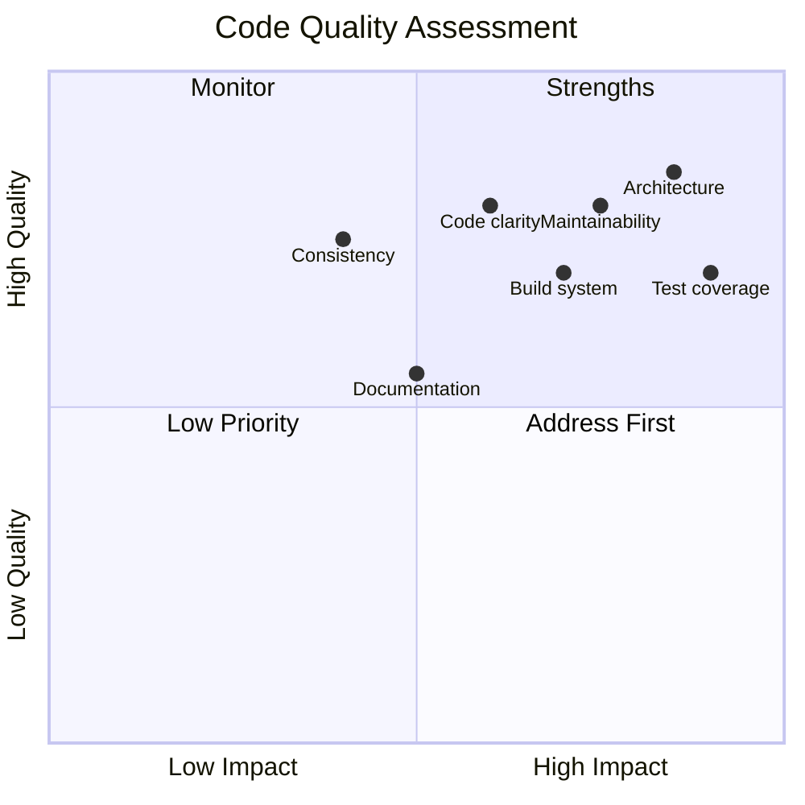

# Code Quality

This document provides an assessment of the opus_flutter codebase's quality across multiple dimensions.

## Summary

| Dimension | Rating | Notes |
|-----------|--------|-------|
| Architecture | Good | Clean federated plugin structure |
| Code clarity | Good | Small, focused files with clear intent |
| Documentation | Fair | Public APIs documented, some packages lack detail |
| Test coverage | Good | 279 unit tests across all packages; opus_dart has extensive mock-based coverage |
| Consistency | Good | Uniform patterns across all packages |
| Maintainability | Good | Clean architecture, proper plugin registration, CI/CD |
| Build system | Good | Modern AGP, deterministic native builds |

---

## Architecture

**Rating: Good**

The project follows Flutter's recommended federated plugin pattern correctly:

- Clear separation between the app-facing package, platform interface, and platform implementations.
- Each package has a single responsibility.
- The platform interface uses `PlatformInterface` from `plugin_platform_interface` with proper token verification.
- All platform packages self-register via `dartPluginClass` and `registerWith()`.
- A single entry point (`opus_flutter_load.dart`) delegates to the platform interface without platform-specific imports.
- Packages have been renamed from `opus_flutter_*` to `opus_codec_*` in their pubspec names while directory names remain `opus_flutter_*`. Each platform package provides an `opus_codec_*.dart` re-export file alongside the original `opus_flutter_*.dart` to support both names.

---

## File-by-File Analysis

### Platform Interface (`opus_flutter_platform_interface`)

| File | Lines | Quality | Notes |
|------|-------|---------|-------|
| `opus_codec_platform_interface.dart` | 1 | Good | Re-export for renamed package |
| `opus_flutter_platform_interface.dart` | 2 | Good | Clean barrel export |
| `opus_flutter_platform_interface.dart` (src) | 48 | Good | Proper PlatformInterface usage, clear docs |
| `opus_flutter_platform_unsupported.dart` | 13 | Good | Appropriate default fallback |

No issues. Well-structured.

### Main Package (`opus_flutter`)

| File | Lines | Quality | Notes |
|------|-------|---------|-------|
| `opus_codec.dart` | 1 | Good | Re-export for renamed package |
| `opus_flutter.dart` | 1 | Good | Single clean export |
| `opus_flutter_load.dart` | 15 | Good | Simple delegation to platform interface |

The main package is minimal by design -- it exports a single `load()` function that delegates to `OpusFlutterPlatform.instance.load()`. Platform registration is handled automatically by Flutter via `dartPluginClass`.

### Android (`opus_flutter_android`)

| File | Lines | Quality | Notes |
|------|-------|---------|-------|
| `opus_codec_android.dart` | 1 | Good | Re-export for renamed package |
| `opus_flutter_android.dart` | 20 | Good | Clean, self-registering via `dartPluginClass` |
| `OpusFlutterAndroidPlugin.java` | 14 | Good | Empty stub, expected for FFI-only plugins |
| `CMakeLists.txt` | 16 | Good | Modern FetchContent approach |
| `build.gradle` | 59 | Good | AGP 8.7.0, compileSdk 35, Java 17 |

The CMakeLists.txt is well-written and concise. The build.gradle uses AGP 8.7.0 with Java 17 compatibility. Test dependencies (`junit`, `mockito`) are included but no actual tests exist yet.

### iOS (`opus_flutter_ios`)

| File | Lines | Quality | Notes |
|------|-------|---------|-------|
| `opus_codec_ios.dart` | 1 | Good | Re-export for renamed package |
| `opus_flutter_ios.dart` | 20 | Good | Clean, self-registering via `dartPluginClass` |
| `OpusFlutterIosPlugin.swift` | 8 | Good | Minimal Swift-only stub |
| `build_xcframework.sh` | 239 | Good | Well-structured, documented, error handling |

Uses Swift-only registration (no ObjC bridge). The build script is well-written with clear sections, error checking, and cleanup.

### Linux (`opus_flutter_linux`)

| File | Lines | Quality | Notes |
|------|-------|---------|-------|
| `opus_codec_linux.dart` | 1 | Good | Re-export for renamed package |
| `opus_flutter_linux.dart` | 76 | Good | Asset-based loading with system fallback, `Abi.current()` arch detection |

The Linux implementation loads a bundled `libopus` from Flutter assets (supporting both x86_64 and aarch64 via `Abi.current()`), copying it to a temp directory at runtime. Falls back to the system-installed `libopus.so.0` if the bundled binary fails. Follows the same asset-copy pattern as the Windows implementation.

### macOS (`opus_flutter_macos`)

| File | Lines | Quality | Notes |
|------|-------|---------|-------|
| `opus_codec_macos.dart` | 1 | Good | Re-export for renamed package |
| `opus_flutter_macos.dart` | 20 | Good | Clean, self-registering via `dartPluginClass` |
| `OpusFlutterMacosPlugin.swift` | 8 | Good | Minimal Swift-only stub |
| `build_xcframework.sh` | 222 | Good | Adapted from iOS script, well-structured |

Uses Swift-only registration (no ObjC bridge).

### Web (`opus_flutter_web`)

| File | Lines | Quality | Notes |
|------|-------|---------|-------|
| `opus_codec_web.dart` | 1 | Good | Re-export for renamed package |
| `opus_flutter_web.dart` | 29 | Good | Uses `wasm_ffi`'s `DynamicLibrary.open()` for JS injection and WASM loading |

The web implementation uses `wasm_ffi`'s `DynamicLibrary.open()` which handles JS injection, Emscripten module compilation, and memory setup internally. This is significantly simpler than the previous approach that required `inject_js` as a separate dependency.

### Windows (`opus_flutter_windows`)

| File | Lines | Quality | Notes |
|------|-------|---------|-------|
| `opus_codec_windows.dart` | 1 | Good | Re-export for renamed package |
| `opus_flutter_windows.dart` | 72 | Good | Asset copying logic, proper arch detection via `Abi.current()` |

The Windows implementation copies DLLs from assets to a temp directory, detecting architecture via `Abi.current()`, and loads dynamically.

### Example App

| File | Lines | Quality | Notes |
|------|-------|---------|-------|
| `main.dart` | 11 | Good | Entry point: loads Opus, initializes, launches app |
| `record_demo/` (18 files) | ~1,830 | Good | Full BLoC-based record-and-playback demo |

The example app has been rewritten as a complete record-and-playback application:

- **Architecture**: BLoC pattern (`flutter_bloc`) with clear separation into app, bloc, core, data, and presentation layers.
- **Features**: Records audio via `record` package, encodes to Opus, decodes back to WAV via `opus_codec_dart`, plays via `audioplayers`.
- **UI**: Custom retro "Opusamp" interface with LCD-style pixel font display, transport buttons (REC/DECODE/PLAY), speaker grille, and gradient styling.
- **Cross-platform storage**: `FileRecordingStorage` on native, `MemoryRecordingStorage` on web.

### Vendored opus_dart (`opus_dart`)

| File | Lines | Quality | Notes |
|------|-------|---------|-------|
| `opus_dart.dart` | 8 | Good | Clean barrel export |
| `opus_codec_dart.dart` | 1 | Good | Re-export for renamed package |
| `proxy_ffi.dart` | 2 | Good | Conditional export: `dart:ffi` on native, `wasm_ffi/ffi.dart` on web |
| `init_ffi.dart` | 10 | Good | Native init: casts `Object` to `DynamicLibrary`, passes `malloc` as allocator |
| `init_web.dart` | 30 | Good | Web init: registers opaque types, uses `wasm_ffi` allocator. Cross-platform analysis artifacts suppressed via `ignore_for_file` |
| `opus_dart_misc.dart` | 101 | Good | Core types and `initOpus()` entry point. All fields statically typed |
| `opus_dart_encoder.dart` | 382 | Good | Simple and buffered encoder implementations |
| `opus_dart_decoder.dart` | 537 | Good | Simple and buffered decoder implementations |
| `opus_dart_packet.dart` | 60 | Good | Packet inspection utilities |
| `opus_dart_streaming.dart` | 378 | Good | Stream transformers for encode/decode pipelines |
| `wrappers/*.dart` | ~855 | Good | FFI bindings. `final` class modifier added for Dart 3 |

The vendored package required several fixes for modern Dart compatibility:

- **`dynamic` elimination:** The original code used `dynamic` for `ApiObject.allocator`, `ApiObject` constructor parameter, and the `_asString` helper. This caused `NoSuchMethodError` at runtime because `dart:ffi` extension methods (`Allocator.call<T>()`, `Pointer<Uint8>.operator []`, `Pointer<T>.asTypedList()`) cannot be dispatched through `dynamic`. All are now statically typed via `proxy_ffi.dart`.
- **`Pointer.elementAt()` removed:** Replaced with `Pointer<Uint8>` extension's `operator []` (deprecated in Dart 3.3, removed in later SDKs).
- **`wasm_ffi` 2.x API:** Corrected import paths (`ffi.dart` not `wasm_ffi.dart`), replaced `boundMemory` with `allocator`.
- **Dart 3 class modifiers:** All `Opaque` subclasses marked `final`.

---

## Dart Style and Conventions

### Positive Patterns

- Doc comments on all public APIs using `///` syntax.
- `@override` annotations used consistently across all platform implementations.
- All platform packages use `dartPluginClass` for self-registration.
- Clear package naming following Flutter conventions.
- Re-export files (`opus_codec_*.dart`) added for renamed packages.

### Issues Found

| Issue | Location | Status |
|-------|----------|--------|
| ~~`opus_flutter_web` excluded from CI~~ | `scripts/common.sh` | Resolved |
| ~~Stale `inject_js` reference~~ | `docs/architecture.md` line 206 | Resolved |
| ~~`new` keyword used in Dart 3 codebase~~ | Various files | Resolved |
| ~~`void` return with `async`~~ | `example/main.dart` | Resolved |
| ~~Empty `initState()` override~~ | `example/main.dart` | Resolved |
| ~~Missing `@override` on `load()`~~ | Platform implementations | Resolved |
| ~~Inconsistent quote style (double vs single)~~ | `example/pubspec.yaml` | Resolved |
| ~~`dynamic` causing runtime extension method failures~~ | `opus_dart` (vendored) | Resolved |
| ~~Removed `dart:ffi` API (`Pointer.elementAt`)~~ | `opus_dart` (vendored) | Resolved |
| ~~Wrong `wasm_ffi` import paths~~ | `opus_dart` (vendored) | Resolved |
| ~~Missing `final` on `Opaque` subclasses~~ | `opus_dart` (vendored) | Resolved |

---

## Dependency Health

```mermaid
graph LR
    subgraph Low Risk
        A[plugin_platform_interface<br>^2.1.8 &#x2022; Active]
        B[flutter_lints<br>^5.0.0 &#x2022; Active]
        C[path_provider<br>^2.1.5 &#x2022; Active]
        D[share_plus<br>^10.0.0 &#x2022; Active]
        E[platform_info<br>^5.0.0 &#x2022; Active]
        H[wasm_ffi<br>^2.1.0 &#x2022; Active]
        I[ffi<br>^2.1.0 &#x2022; Active]
    end

    subgraph Vendored
        G[opus_dart<br>v3.0.5 &#x2022; in-repo]
    end

    style A fill:#c8e6c9,color:#000
    style B fill:#c8e6c9,color:#000
    style C fill:#c8e6c9,color:#000
    style D fill:#c8e6c9,color:#000
    style E fill:#c8e6c9,color:#000
    style G fill:#ce93d8,color:#000
    style H fill:#c8e6c9,color:#000
    style I fill:#c8e6c9,color:#000
```

| Dependency | Version | Last Updated | Risk |
|------------|---------|-------------|------|
| `plugin_platform_interface` | ^2.1.8 | Active | Low |
| `flutter_lints` | ^5.0.0 | Active | Low |
| `path_provider` | ^2.1.5 | Active | Low |
| `wasm_ffi` | ^2.1.0 | Active | Low |
| `ffi` | ^2.1.0 | Active | Low |
| `opus_dart` | v3.0.5 | Vendored | None |
| `share_plus` | ^10.0.0 | Active | Low |
| `platform_info` | ^5.0.0 | Active | Low |

`opus_dart` has been vendored into the repository, eliminating it as an external dependency risk. The migration from `web_ffi` to `wasm_ffi` previously eliminated the highest-risk dependency. `inject_js` is no longer a direct dependency -- the web implementation now uses `wasm_ffi`'s `DynamicLibrary.open()` which handles JS injection internally.

The example app adds several dependencies (`record`, `audioplayers`, `flutter_bloc`, `google_fonts`, `universal_io`, `cupertino_icons`) that do not affect the published packages.

---

## Build System Quality

### Android
- **Approach:** CMake FetchContent (downloads opus at build time).
- **Strength:** No vendored sources; always builds from a pinned tag.
- **Risk:** Requires internet during build; network issues or removed GitHub tags will break builds.
- **AGP:** 8.7.0 with Java 17, compileSdk 35.

### iOS
- **Approach:** Pre-built xcframework via shell script.
- **Strength:** Deterministic; no network needed at app build time.
- **Risk:** Script must be re-run manually to update opus.

### Linux
- **Approach:** Pre-built shared libraries via Docker, stored as Flutter assets.
- **Strength:** Deterministic; no network or system dependency needed at app build time. Supports x86_64 and aarch64.
- **Risk:** None significant. Uses `ubuntu:20.04` as base image (glibc 2.31 for broad compatibility). Falls back to system `libopus.so.0` if bundled binary fails.

### macOS
- **Approach:** Same as iOS.
- **Strength/Risk:** Same as iOS.

### Windows
- **Approach:** Cross-compiled via Docker, DLLs stored as assets.
- **Strength:** Deterministic; no network needed at app build time.
- **Risk:** None significant. Uses `ubuntu:24.04` as base image.

### Web
- **Approach:** Compiled via Emscripten in Docker.
- **Strength:** Deterministic output.
- **Risk:** Same Docker base image concern as Windows.

---

## CI/CD

Two GitHub Actions workflows:

- **`ci.yml`**: Runs on push/PR to `master` and `development`. Runs format, analyze, and unit tests via scripts, then builds the example app for Android, iOS, macOS, Linux, Windows, and web. Deploys the web build to GitHub Pages on push.
- **`publish.yml`**: Manual workflow with dry-run option. Runs the full test suite, then publishes packages in dependency order via `scripts/publish.sh`.

Scripts (`scripts/`):

| Script | Purpose |
|--------|---------|
| `common.sh` | Shared config: package lists, colors, log helpers |
| `format.sh` | `dart format --set-exit-if-changed` for all packages |
| `analyze.sh` | `flutter analyze` / `dart analyze` for all packages |
| `unit_tests.sh` | Runs tests with coverage, merges lcov reports |
| `publish.sh` | Publishes packages to pub.dev in dependency order |
| `prepare_publish.dart` | Adjusts pubspecs before publish |
| `sync_changelogs.sh` | Copies root CHANGELOG to all Flutter packages |
| `check_dependencies.sh` | Runs `pub outdated`, checks for discontinued packages |
| `run.sh` | Runs the example app for a given platform |

All packages including `opus_flutter_web` are covered by CI via `FLUTTER_PACKAGES` in `common.sh`.

---

## Lint Coverage

| Package | Has `analysis_options.yaml` | Lint package |
|---------|----------------------------|-------------|
| opus_flutter | Yes | flutter_lints |
| opus_flutter_platform_interface | Yes | flutter_lints |
| opus_flutter_android | Yes | flutter_lints |
| opus_flutter_ios | Yes | flutter_lints |
| opus_flutter_linux | Yes | flutter_lints |
| opus_flutter_macos | Yes | flutter_lints |
| opus_flutter_web | Yes | flutter_lints |
| opus_flutter_windows | Yes | flutter_lints |
| opus_dart | Yes | `package:lints/recommended.yaml` (`constant_identifier_names` disabled for C API names) |
| example | Yes | flutter_lints |

All Flutter packages have lint configuration referencing `package:flutter_lints/flutter.yaml`. Most platform packages add `invalid_dependency: ignore` (exceptions: `opus_flutter_platform_interface` and `opus_flutter_web`). The vendored `opus_dart` is a pure Dart package and uses `package:lints/recommended.yaml` (the non-Flutter equivalent) with `constant_identifier_names` disabled since the FFI wrappers mirror upstream C API naming conventions. All files pass `dart analyze` and `dart format`.

---

## Test Coverage

| Package | Test Files | Unit Tests | Widget Tests | Integration Tests |
|---------|-----------|-----------|-------------|-------------------|
| opus_flutter | 1 | 9 tests | None | None |
| opus_flutter_platform_interface | 1 | 13 tests | None | None |
| opus_flutter_android | 1 | 5 tests | None | None |
| opus_flutter_ios | 1 | 5 tests | None | None |
| opus_flutter_linux | 1 | 5 tests | None | None |
| opus_flutter_macos | 1 | 5 tests | None | None |
| opus_flutter_web | 1 | 3 tests | None | None |
| opus_flutter_windows | 1 | 5 tests | None | None |
| opus_dart | 5 | 228 tests | None | None |
| example | 0 | None | None | None |
| **Total** | **13** | **279 tests** | **None** | **None** |

Unit tests cover:

- **Platform interface** (13 tests): singleton pattern, token verification, version constant, error handling, mock substitution, `UnsupportedError` on unsupported platform.
- **Platform implementations** (5 tests each, 3 for web): `registerWith()` sets the singleton, creates new instances, independent instances, `load()` returns `Future<Object>`. Native library loading (`DynamicLibrary.open()` / `.process()`) cannot be unit tested as it requires the actual opus binary.
- **App-facing package** (9 tests): delegation to platform, error propagation, multiple calls, async platform support, `UnsupportedError` message verification.
- **opus_dart** (228 tests across 5 files):
  - Core API (27): `maxDataBytes`, `maxSamplesPerPacket`, error classes, `Application` and `FrameTime` enums.
  - Streaming (11): `FrameTime` ordering, `calculateMaxSampleSize` across sample rates and channel counts.
  - Mock encoder/decoder (100): full lifecycle (create/use/destroy), `OpusDestroyedError` after destroy, buffer management, custom parameters, `encoderCtl`, `pcmSoftClip`, `OpusPacketUtils`.
  - Streaming with mocks (53): stream binding, partial frames, `fillUpLastFrame`, `UnfinishedFrameException`, forward error correction (FEC), `copyOutput`, destroy on stream end/error.
  - Defines constants (37): all CTL IDs, error codes, application types, bandwidth constants, frame size constants.

---

## Recommendations by Priority

### High Priority

1. ~~**Add `opus_flutter_web` to CI**~~ -- Resolved: added to `FLUTTER_PACKAGES` in `scripts/common.sh`.

### Medium Priority

2. ~~**Fix stale `inject_js` reference**~~ -- Resolved: updated `docs/architecture.md` to reflect that the web implementation uses `wasm_ffi`'s `DynamicLibrary.open()` exclusively.

### Resolved

- ~~**Add tests**~~ -- Resolved: 279 unit tests across all packages.
- ~~**Update Docker base images**~~ -- Resolved: Windows Dockerfile updated from `ubuntu:bionic` (18.04, EOL) to `ubuntu:24.04`.
- ~~**Add `opus_dart` to CI**~~ -- Resolved: dedicated `analyze-opus-dart` and `test-opus-dart` jobs added.
- ~~**Add `analysis_options.yaml` to `opus_dart`**~~ -- Resolved: uses `package:lints/recommended.yaml`.
- ~~**Fix `opus_dart` formatting**~~ -- Resolved: all files pass `dart format`.
- ~~**Add unit tests for `opus_dart` pure logic**~~ -- Resolved: 228 tests added (up from 13).
- ~~**Add CI/CD**~~ -- GitHub Actions workflow added.
- ~~**Add `analysis_options.yaml`**~~ -- All packages have consistent lint rules.
- ~~**Evaluate web_ffi alternatives**~~ -- Migrated to `wasm_ffi` ^2.1.0.
- ~~**Check if Flutter workarounds are still needed**~~ -- Removed; all platforms use `dartPluginClass`.
- ~~**Fix Dockerfile typos**~~ -- `DEBIAN_FRONTEND` corrected.
- ~~**Simplify iOS plugin**~~ -- Swift-only, ObjC bridge removed.
- ~~**Remove `new` keyword**~~ -- Cleaned up across codebase.
- ~~**Align podspec versions**~~ -- Matched to pubspec versions.
- ~~**Add Linux support**~~ -- `opus_flutter_linux` package added.
- ~~**Vendor opus_dart**~~ -- Copied into repository, updated for Dart 3 and `wasm_ffi` 2.x.
- ~~**Fix `dynamic` dispatch crashes**~~ -- Eliminated all `dynamic` usage in `opus_dart` that caused `NoSuchMethodError` at runtime when `dart:ffi` extension methods were called through dynamic dispatch.
- ~~**Fix removed `dart:ffi` APIs**~~ -- Replaced `Pointer.elementAt()` with modern `operator []`.
- ~~**Fix `wasm_ffi` import paths**~~ -- Corrected from `wasm_ffi.dart` / `wasm_ffi_modules.dart` to `ffi.dart`.
- ~~**Dart 3 class modifier compliance**~~ -- Added `final` to all `Opaque` subclasses in wrapper files.
