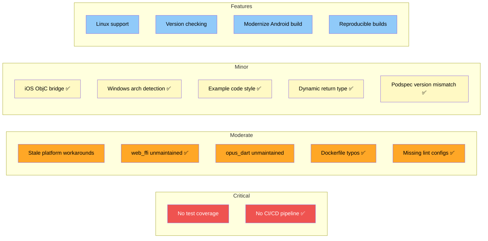

# Issues and Improvements

This document lists known issues, potential risks, and suggested improvements for the opus_flutter project.

## Critical Issues

### 1. No test coverage

There are zero tests across all seven packages. No unit tests, no widget tests, no integration tests. This is the single largest risk in the project.

**Impact:** Any change to platform loading logic, the platform interface, or the workaround code could silently break without detection.

**Recommendation:**
- Add unit tests for each platform implementation (mock `DynamicLibrary` calls).
- Add a platform interface test that verifies the singleton pattern and token verification.
- Add integration tests in the example app that verify `load()` returns a valid library.

### 2. ~~No CI/CD pipeline~~ RESOLVED

**Status:** Fixed. Added `.github/workflows/ci.yml` with analysis (lint + format) for all 8 packages and example app builds for Android, iOS, Linux, macOS, and Web.

---

## Moderate Issues

### 3. Platform workarounds may be stale

`opus_flutter_ffi.dart` contains workarounds for two Flutter issues:
- [flutter/flutter#52267](https://github.com/flutter/flutter/issues/52267) (platform auto-registration)
- [flutter/flutter#81421](https://github.com/flutter/flutter/issues/81421) (Windows dartPluginClass)

These workarounds import all platform packages on every platform, which means the Android implementation code is compiled into iOS builds and vice versa. The issues may have been resolved in newer Flutter versions.

**Impact:** Increased binary size. Unnecessary complexity. Imports may cause issues on some platforms.

**Recommendation:**
- Check whether these Flutter issues have been fixed in Flutter 3.22+.
- If fixed, remove the workarounds and let the framework handle registration.
- If not fixed, document clearly why they are still needed.

### 4. ~~`web_ffi` is unmaintained~~ RESOLVED

**Status:** Migrated from `web_ffi` (v0.7.2, unmaintained) to `wasm_ffi` (v2.2.0, actively maintained).

`wasm_ffi` is a drop-in replacement for `dart:ffi` on the web, built on top of `web_ffi` with active maintenance and modern Dart support. The API change was minimal -- `EmscriptenModule.compile` now takes a `Map<String, dynamic>` with a `'wasmBinary'` key instead of raw bytes.

### 5. `opus_dart` is not actively maintained

The `opus_dart` package (v3.0.1) has not been updated in over 2 years. Since opus_flutter exists primarily to serve opus_dart, this is a concern for the overall ecosystem.

**Impact:** Users depend on a stale package for the actual codec functionality.

**Recommendation:**
- If this is now your project, consider forking or taking over opus_dart as well.
- Ensure opus_dart works with Dart 3.4+ and test it.

### 6. ~~Dockerfile typos~~ RESOLVED

**Status:** Fixed. Both `opus_flutter_web/Dockerfile` and `opus_flutter_windows/Dockerfile` now use the correct `DEBIAN_FRONTEND` spelling.

### 7. ~~Missing `analysis_options.yaml` in most packages~~ RESOLVED

**Status:** Fixed. All 7 packages and the example app now have `analysis_options.yaml` referencing `package:flutter_lints/flutter.yaml`.

---

## Minor Issues

### 8. ~~iOS plugin uses ObjC bridge unnecessarily~~ RESOLVED

**Status:** Fixed. Simplified to a single Swift file (`OpusFlutterIosPlugin.swift`), matching the macOS implementation.

### 9. ~~Windows implementation has architecture detection fragility~~ RESOLVED

**Status:** Fixed. Replaced `Platform.version.contains('x64')` with `Abi.current() == Abi.windowsX64` from `dart:ffi`, which is the proper API for architecture detection.

### 10. ~~Example app code style issues~~ RESOLVED

**Status:** Fixed. `_share` now returns `Future<void>`, empty `initState()` override removed, and MIME type consistently uses `'audio/wav'`.

### 11. ~~`load()` returns `Future<dynamic>`~~ RESOLVED

**Status:** Fixed. Changed `Future<dynamic>` to `Future<Object>` across the platform interface and all 6 platform implementations. This enforces non-null returns and requires explicit casts, improving type safety.

### 12. ~~Podspec versions don't match pubspec versions~~ RESOLVED

**Status:** Fixed. iOS podspec now matches pubspec at `3.0.1`, macOS podspec matches at `3.0.0`.

---

## Feature Improvements

### 13. ~~Add Linux support~~ RESOLVED

**Status:** Fixed. Created `opus_flutter_linux` package that loads opus from the system library via `DynamicLibrary.open('libopus.so.0')`. Users must install `libopus` on their system (e.g. `sudo apt install libopus0`). This completes the Flutter desktop story -- all six platforms are now supported.

### 14. ~~Add version checking~~ RESOLVED

**Status:** Fixed. Added `static const String opusVersion = '1.5.2'` to `OpusFlutterPlatform` in the platform interface. All platforms (Android, iOS, macOS, Windows, Web) bundle opus v1.5.2.

### 15. ~~Modernize Android build configuration~~ RESOLVED

**Status:** Fixed. Updated the plugin's `build.gradle`:
- AGP updated from `7.3.0` to `8.7.0`.
- `compileSdk` updated from `34` to `35`.
- Java compatibility updated from `VERSION_1_8` to `VERSION_17`.
- `namespace` set directly (removed conditional check).
- Example app also updated: AGP `8.7.0`, Gradle `8.9`, Java `VERSION_17`.

### 16. Bundle opus sources for reproducible builds

Currently, Android fetches opus at build time via `FetchContent`, iOS/macOS use a build script that clones from GitHub, and Windows/Web use Docker. If GitHub is unavailable or the tag is removed, builds will fail.

**Recommendation:**
- Consider vendoring a source archive or using a git submodule for opus across all platforms.
- Pin checksums for downloaded archives.
