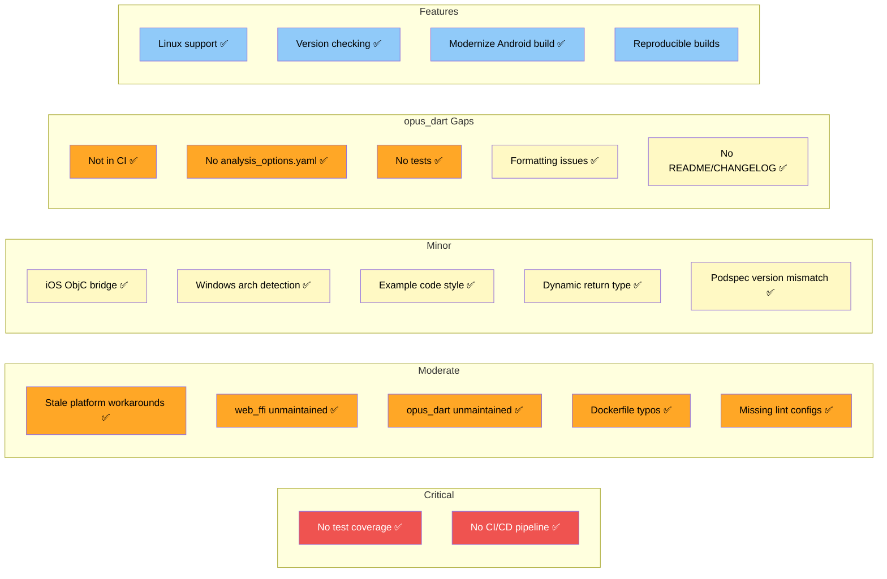

# Issues and Improvements

This document lists known issues, potential risks, and suggested improvements for the opus_flutter project.

## Critical Issues

### 1. ~~No test coverage~~ RESOLVED

**Status:** Fixed. Added 20 unit tests across 8 packages covering:
- Platform interface contract (singleton pattern, token verification, version constant, error handling).
- Registration logic (`registerWith()`, class hierarchy) for all 6 platform implementations.
- Main package delegation (`load()` delegates to platform instance, throws on unsupported platform).
- CI workflow updated to run `flutter test` for all packages on every push.

### 2. ~~No CI/CD pipeline~~ RESOLVED

**Status:** Fixed. Added `.github/workflows/ci.yml` with analysis (lint + format) for all 8 packages and example app builds for Android, iOS, Linux, macOS, and Web.

---

## Moderate Issues

### 3. ~~Platform workarounds may be stale~~ RESOLVED

**Status:** Fixed. Removed all registration workarounds and cross-platform imports. All platform packages now declare `dartPluginClass` in their `pubspec.yaml` and provide a static `registerWith()` method, letting Flutter handle registration automatically. The conditional export (`opus_flutter_ffi.dart` vs `opus_flutter_web.dart`) has been replaced by a single entry point (`opus_flutter_load.dart`).

### 4. ~~`web_ffi` is unmaintained~~ RESOLVED

**Status:** Migrated from `web_ffi` (v0.7.2, unmaintained) to `wasm_ffi` (v2.2.0, actively maintained).

`wasm_ffi` is a drop-in replacement for `dart:ffi` on the web, built on top of `web_ffi` with active maintenance and modern Dart support. The API change was minimal -- `EmscriptenModule.compile` now takes a `Map<String, dynamic>` with a `'wasmBinary'` key instead of raw bytes.

### 5. ~~`opus_dart` is not actively maintained~~ RESOLVED

**Status:** Fixed. Vendored `opus_dart` (v3.0.1) from [EPNW/opus_dart](https://github.com/EPNW/opus_dart) directly into the repository at `opus_dart/`. This eliminates the external dependency and allows direct maintenance. The example app now uses a path dependency instead of pulling from pub.dev.

Additionally, the vendored package required several fixes to work with modern Dart and the correct `wasm_ffi` version:

- **Dart 3 class modifiers:** All `Opaque` subclasses in wrapper files now use the `final` modifier, required because `dart:ffi`'s `Opaque` is a `base` class.
- **`wasm_ffi` 2.x import paths:** The package exports `ffi.dart`, not `wasm_ffi.dart`. The non-existent `wasm_ffi_modules.dart` import was removed (`registerOpaqueType` is exported from `ffi.dart` directly).
- **Deprecated `boundMemory`:** Replaced with `allocator` on `wasm_ffi`'s `DynamicLibrary`.
- **Removed `Pointer.elementAt()`:** Deprecated in Dart 3.3 and removed in later SDKs. Replaced with `Pointer<Uint8>` extension's `operator []`.
- **Eliminated `dynamic` dispatch:** The original code used `dynamic` for several fields and parameters to bridge `dart:ffi` and `web_ffi` types. This caused runtime `NoSuchMethodError` crashes because many `dart:ffi` APIs (`Allocator.call<T>()`, `Pointer[].operator []`, `Pointer.asTypedList()`, `DynamicLibrary.lookupFunction<>()`) are **extension methods** that cannot be dispatched through `dynamic`. All fields are now statically typed via `proxy_ffi.dart`.
- **`initOpus()` accepts `Object`:** Callers no longer need to cast from `opus_flutter.load()`'s `Future<Object>` return type; the platform-specific `createApiObject()` handles the cast internally.
- **Cleaned up stale headers:** Replaced "AUTOMATICALLY GENERATED FILE. DO NOT MODIFY." with "Vendored from" attribution, removed dead `subtype_of_sealed_class` lint suppressions.

### 6. ~~Dockerfile typos~~ RESOLVED

**Status:** Fixed. Both `opus_flutter_web/Dockerfile` and `opus_flutter_windows/Dockerfile` now use the correct `DEBIAN_FRONTEND` spelling.

### 7. ~~Missing `analysis_options.yaml` in most packages~~ RESOLVED

**Status:** Fixed. All 7 packages and the example app now have `analysis_options.yaml` referencing `package:flutter_lints/flutter.yaml`.

---

## Minor Issues

### 8. ~~iOS plugin uses ObjC bridge unnecessarily~~ RESOLVED

**Status:** Fixed. Simplified to a single Swift file (`OpusFlutterIosPlugin.swift`), matching the macOS implementation.

### 9. ~~Windows implementation has architecture detection fragility~~ RESOLVED

**Status:** Fixed. Replaced `Platform.version.contains('x64')` with `Abi.current() == Abi.windowsX64` from `dart:ffi`, which is the proper API for architecture detection.

### 10. ~~Example app code style issues~~ RESOLVED

**Status:** Fixed. `_share` now returns `Future<void>`, empty `initState()` override removed, and MIME type consistently uses `'audio/wav'`.

### 11. ~~`load()` returns `Future<dynamic>`~~ RESOLVED

**Status:** Fixed. Changed `Future<dynamic>` to `Future<Object>` across the platform interface and all platform implementations. This enforces non-null returns and improves type safety.

### 12. ~~Podspec versions don't match pubspec versions~~ RESOLVED

**Status:** Fixed. iOS podspec now matches pubspec at `3.0.1`, macOS podspec matches at `3.0.0`.

---

## Vendored opus_dart Gaps

### 17. ~~`opus_dart` not included in CI~~ RESOLVED

**Status:** Fixed. Added a dedicated `analyze-opus-dart` job (using `dart analyze` and `dart format` since it's a pure Dart package, not a Flutter package) and a `test-opus-dart` job to the CI workflow.

### 18. ~~`opus_dart` missing `analysis_options.yaml`~~ RESOLVED

**Status:** Fixed. Added `analysis_options.yaml` referencing `package:lints/recommended.yaml` with `constant_identifier_names` disabled (the FFI wrappers intentionally mirror C API naming like `OPUS_SET_BITRATE_REQUEST`). Added `lints` and `test` as dev dependencies.

### 19. ~~`opus_dart` has no tests~~ RESOLVED

**Status:** Fixed. Added 13 unit tests covering pure-logic helpers that don't require the native opus binary:
- `maxDataBytes` constant value.
- `maxSamplesPerPacket()` across standard sample rates and channel counts.
- `OpusDestroyedError` encoder/decoder message content.
- `OpusException` error code storage.
- `Application` and `FrameTime` enum completeness.

FFI-dependent code (encoding, decoding, streaming, packet inspection) requires the actual opus library and would need integration-level tests.

### 20. ~~`opus_dart` has formatting issues~~ RESOLVED

**Status:** Fixed. All files now pass `dart format --set-exit-if-changed`. Additionally, all 85 lint issues from `dart analyze` were resolved (library name removal, unnecessary `this`/`const`, adjacent string concatenation, local identifier naming).

### 21. ~~`opus_dart` missing README and CHANGELOG~~ RESOLVED

**Status:** Fixed. Added `README.md` covering the Dart-friendly API, raw bindings, initialization with `opus_flutter`, cross-platform FFI via `proxy_ffi.dart`, and encoder CTL usage. Updated from the original EPNW README to reflect the vendored state (opus 1.5.2, `wasm_ffi` instead of `web_ffi`, `publish_to: none`, no stale external links). CHANGELOG omitted since version history is tracked in git.

---

## Feature Improvements

### 13. ~~Add Linux support~~ RESOLVED

**Status:** Fixed. Created `opus_flutter_linux` package that loads opus from the system library via `DynamicLibrary.open('libopus.so.0')`. Users must install `libopus` on their system (e.g. `sudo apt install libopus0`). This completes the Flutter desktop story -- all six platforms are now supported.

### 14. ~~Add version checking~~ RESOLVED

**Status:** Fixed. Added `static const String opusVersion = '1.5.2'` to `OpusFlutterPlatform` in the platform interface. All platforms (Android, iOS, macOS, Windows, Web) bundle opus v1.5.2.

### 15. ~~Modernize Android build configuration~~ RESOLVED

**Status:** Fixed. Updated the plugin's `build.gradle`:
- AGP updated from `7.3.0` to `8.7.0`.
- `compileSdk` updated from `34` to `35`.
- Java compatibility updated from `VERSION_1_8` to `VERSION_17`.
- `namespace` set directly (removed conditional check).
- Example app also updated: AGP `8.7.0`, Gradle `8.9`, Java `VERSION_17`.

### 16. Bundle opus sources for reproducible builds

Currently, Android fetches opus at build time via `FetchContent`, iOS/macOS use a build script that clones from GitHub, and Windows/Web use Docker. If GitHub is unavailable or the tag is removed, builds will fail.

**Recommendation:**
- Consider vendoring a source archive or using a git submodule for opus across all platforms.
- Pin checksums for downloaded archives.
